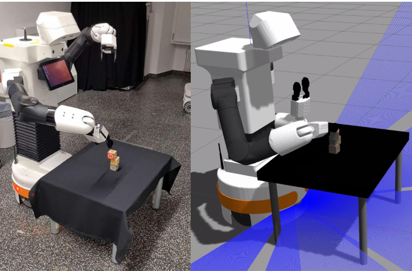

# Robot adventures with cubes
## Project Lab on Intelligent Robotic Manipulation @ iRosa, TU Darmstadt (https://irosalab.com/)
## by Team AGI: Rickmer Krohn, Kai Liu, Nicolas Nonnengießer and Qiao Sun (equal contribution)

Hello everyone! 
In our project we have developed a Sense-Plan-Act pipeline for sequential cube stacking with Tiago++. This repository only contains our "solution" and it's therefore not sufficient to run on its own. Still, in combination with our blog it can give you some insights into robotic projects. 

More details of the project will be provided by our blog, which will be published in the next days. 
